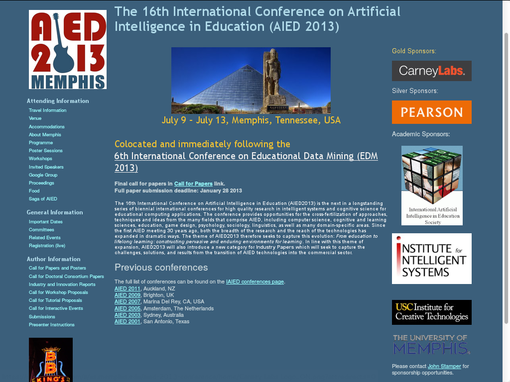

Table of Contents
========================

**[Overview](#overview)**  
**[The Best Example](#the-best-example)**  
**[Recruiting Others](#recruiting-others)**
**[Task By Task](#task-by-task)**

## Overview

Hosting an academic conference is a big job. It's manageable with a lot of planning and experience, but most people only do it once and start with **zero** experience and naive planning.

Hopefully this document will help. There are a lot of approaches to communicating how this works, but two seem to be the most salient/useful:

* A top-down decomposition of the **product**
* A timeline of tasks

Let's look at these in turn.

### Product

Like it or not, you are creating a product that people will buy. People want value for their money. That means you need to carefully think about the **customer** and the experience they will have. Will this be a conference that people remember fondly five years later? One that will be forgotten in a year? Or one that people will be cursing ten years later (yes that happens, don't let it happen to you)?

Because you are making a product, I recommend a top-down decomposition that is *outside-in*. Start with what people will touch/contact/experience and then consider the infrastructure/planning to support it. Here are some examples:

- **Wrong way:** We need a registration website, what can we use?
- **Right way:** When people register, they need to express meal preferences. They will also need to be able to edit their existing registrations if their plans change. What registration websites would support this functionality?

If the right way sounds a lot like requirements engineering in software development, you're not wrong.

### Timeline

It's true that there are some tasks that are dependent on others. Some tasks have an extended duration and contain a hierarchy of subtasks (e.g. setting up the conference program). However, the timeline isn't quite as tricky as you might think, so don't panic.

## The Best Example

The best example for any conference is *last year's conference*. The best place to start with that is the conference website if it is still available. I'm going to use [Artificial Intelligence in Education 2013](http://aied2013.memphis.edu/) as my running example. 

You can get a lot of information about the last conference from their website, but not all. It's still a good place to start. However, the website can be misleading, because typically they start as "shells" that are filled in/elaborated as more information becomes available. What you see when you look at last year's website is the final product, not how it started.

The website is an important part of your communication strategy. You should provide as much information as soon as possible on the website. However, the website **is just one part** of your communication strategy. Email is another important part for making announcements (like the fact that your website exists, the CFP, the call for workshops, that registration is open, etc). Since websites are a "pull" form of communication, people won't know anything unless they go there to read it. Emails is a "push" form of communication so that people will know to go to the website, etc (assuming they read their email). Social media can combine these elements, but you may be leary of that since you don't want to require people to be on a particular social media platform. Web and email are universal.

Let's look at the website:

Admittedly this isn't the best looking website in the world. You might want to think about how you could do a better job. Let's assume that this website went through three versions as follows:

### Early

Early on, people need to do necessary planning to attend your conference. To book travel, hotel, get visas, etc, they need to know when/where it is. You also want to consider making your conference attractive.

Behind the scenes, you need to make sure you have assets like the conference location in place. If you don't book them, they may not be available for your conference dates. To book, you'll need to put down deposits. This means that you need to have some money up front, some way of spending funds (like a bank account), and the beginnings of a budget.

To book anything you'll need an approximate head count. The best way to get that is to ask the previous conference organizers. Sometimes the previous proceedings will have a forward that lists the submissions and accepted papers. The number of attendees will be greater than the number of accepted papers.

#### Things for the site

* Location of the conference, booked (i.e. the actual building)
* Dates of the conference (distinguish workshop days from main conference; give date of banquet)
* How to get to the conference (airports, taxi, public transportation, etc)
* Where to stay/sleep at night (easy if the conference is in a hotel, you may want to book/reserve rooms)
* Where to eat (what food will the conference provide? Off site food? Consider special diets like vegetarian)
* Things to do besides the conference (some people will add a day on either side of the conference for this)
* How to request a visa letter
* Custom logo that will appear on site and elsewhere

#### Behind the scenes

* Recruit sponsors
* Create a working budget
* Determine how to spend/receive funds (may need a "float" loan from professional society)
* Book the banquet location
* Book the hotels if applicable
* Book the conference location
* Invite keynote speakers, put them on the website as soon as you can
* Recruit Program Committee and any needed Conference Executive Committee
* Have agreement with publisher if applicable on conference proceedings
  
  
### Middle

It's easy to get complacent once you have a site. However, you should not lose track of the important fact **most people need to be reminded to look at it**, so if it changes in a major you need to send an annoucement by email.

The major additions at this stage are the submission/reviewing process and registration. You would be amazed how early some people submit and register. You want people to register as early as possible because you will need head counts for food and other items. So encoraging people to register early is a good idea (early/late/onsite rates can help).

#### Things for the site

* Call for papers (must also email!)
* Instructions for authors/templates
* Submission website to conduct review process (e.g. EasyChair)
* Call for worshops/tutorials/demonstrations (must also email)
* Important dates (due dates for papers/proposals; acceptance dates for the same)
* Personnel (like the Program Committee and the Conference Executive Comittee)
* Registration
 
#### Behind the scenes

* Solicit volunteers (may be tied to accepted papers)
* Purchase presentation equipment (posterboards, easels, powercords, etc)
* Purchase conference bag/schwag -- may take time to print with custom logo
* 

### Late (but not too late!)

At this stage, people will want to know when they are presenting. If they volunteered to be a session chair, they will want to know where you assigned them.

#### Things for the site

* Conference schedule (times for presentations, session chairs, breaks, meals, etc)
* Presenter instructions (also email with acceptance)

#### Behind the scenes

* Attendee badges (requires head count; I like badges with integrated schedules)
* Make sure all volunteers know where to go/what to do/when they are needed
* Rent/order equipment (microphones, projectors, etc)
* Arrange group transport to banquet if applicable (requires head count)
* Finalized food for conference (requires head count)
* Create signage so people know where to go; signage for sponsors
* Prepare welcome/introduction presentations for conference
  
### During

During the conference, people will come in at widely different times. They will not know exactly where to go, what talks are happening now, where to register, or how to check their email.

People will not remember **anything** about their registration. They will not remember if they ordered extra proceedings, bought a banquet ticket, or paid with credit card. You must have excellent record keeping. 

Important tasks are:
* Place adequate signage and have volunteers to give directions
* Run the registration desk
 * Hand out badges, proceedings, schwag
 * Be prepared for "on-site" registration
 * Be prepared for "add-on" registration
 * Be prepared to take payments on site
* Have a contact facilty so people can come to you with problems
* Provide and **communicate** WiFi access
* Provide a "lost and found"
* Make sure session chairs know their jobs (where to go, how to keep time, how to handle questions)
* Be prepared to put out fires

## Recruiting Others

The most important things to keep in mind when you recruit others to help you with this are

* Can they do their job
* Will they do their job

It is important for you to understand what their job is and communicate it to them. If you don't know, they won't know. Hopefully this document will help in this regard.

In my mind, there are two primary and largely non-overlapping functionalities to an academic conference:

* Program Chair(s)
* Local Organizer(s)

Program Chairs handle everything to do with the academic part of the program. This includes:

* Suggesting/inviting keynote speakers
* Recruiting the Program Committee 
* Creating the call for papers (CFP)
* Setting up the reviewing website
* Managing the review process
* Creating the schedule of talks (talks should be in logical clusters; interfaces with local organizers)
* Handling the best paper process
* Publishing the proceedings/writing the forward (may involve discussing/negotiating with publisher; cost interfaces with local organizers)
* Creating the call for workshops/tutorials
* Reviewing these, accepting workshop/tutorial chairs, guiding them re publishing process

Local Organizers do basically everything else (see above).

Under these two main functionalities, roles can be created/assigned as needed. There are several factors to consider when assigning/creating Conference Executive Committee roles:

* Small jobs train for big jobs: Someone in a small job this year may be running the conference next year.
* Nationality/gender bias: When creating roles, go out of your way to be inclusive. Avoid inbreeding.
* Sometimes famous people are too busy to take on a major role
* Your Local Organizer needs to be **organized**
* Your Program Chair needs to be **well-established** and be able to effectively recruit the PC

Here are some example roles:

* Conference Chair: This could be a pure management role or a "working" role (e.g. combined with local organizer)
* Local Arrangements Chairs: see above
 * Sponsorship Chair
 * Registration Chair
 * Banquet Chair
 * Signage Chair
 * Bag/Schwag Chair
 * Volunteer Chair
* Program Chairs: see above
 * Program Committee
 * Workshop Chairs
 * Poster Chairs
 * Demo Chairs
 * Doctoral Consortium Chairs
 * Panel Chairs
 * Award Chairs (Best paper, etc)

When you create/assign roles, consider:

* Is the task set relatively independent of existing tasks
* Who does this person report to

Sometimes if a job is really small (making signs) it may not make sense to create a chair for it. 

## Task By Task
